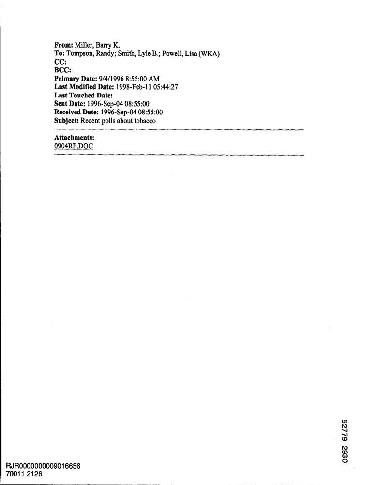

# Intelligent-Document-Understanding-API
 An intelligent document processing API built with FastAPI. Accepts image or PDF uploads, performs OCR to extract text, classifies the document type using semantic similarity (FAISS + Sentence Transformers), and extracts structured data fields with LLMs (via Ollama). Returns a clean, standardized JSON response with all relevant information.

 REST API built with **FastAPI** that processes documents (PDFs and images) to:

1. Perform OCR (EasyOCR for images, pdfplumber for PDFs).
2. Classify each document using semantic similarity (Sentence-Transformers + FAISS).
3. Extract specific fields based on the document type using a local *Llama 3* model served via **Ollama**.


---

## Table of Contents

- [Architecture & Flow](#architecture--flow)
- [Requirements](#requirements)
- [Installation](#installation)
- [Environment Variables](#environment-variables)
- [Running the App](#running-the-app)
- [Endpoint: /extract\_entities](#endpoint-extract_entities)
- [Usage Examples](#usage-examples)
- [Project Structure](#project-structure)
- [Building or Updating the FAISS Index](#building-or-updating-the-faiss-index)
- [Testing](#testing)

---

## Architecture & Flow

1. **Upload & Validation**\
   The user uploads one or more files (`.pdf`, `.jpg`, `.png`, `.jpeg`).\
   Each file is validated to ensure it's in an accepted format.

2. **Temporary Storage**\
   Files are saved temporarily in a local `uploads/` directory.\
   A UUID is added to avoid filename collisions.

3. **OCR (Optical Character Recognition)**\
   If the file is an image, `EasyOCR` is used to extract text.\
   If it's a PDF, `pdfplumber` extracts text from each page.\
   If no legible text is found, a 415 error is raised.

4. **Semantic Document Classification**\
   The extracted text is embedded using a pre-trained `SentenceTransformer` model (`all-MiniLM-L6-v2`).\
   The embedding is compared against a `FAISS` vector index built from sample documents.\
   The top-matching document type (e.g., `invoice`, `receipt`, `memo`) is returned along with a confidence score and list of similar examples.

5. **Entity Extraction using LLM (via Ollama)**\
   A list of expected fields is loaded from `document_schema.json` based on the predicted document type.\
   A prompt is generated dynamically asking the LLM to extract those fields from the OCR’d text.\
   The prompt is sent to a locally running Llama 3 model served via **Ollama**.\
   The model returns a clean JSON object containing the extracted fields.

6. **Response Construction**\
   For each uploaded file, the final response includes:

   - The filename
   - Detected document type
   - Confidence score
   - Extracted structured fields (as JSON)

7. **Cleanup**\
   The temporary file is deleted after processing.

---

## Example of use 

### Uploaded image



### Reqeuest

```bash
curl -X POST http://localhost:8000/extract_entities/ \
  -F "files=@docs/527792930+-2930.jpg"
```

### Response
```json
{
  "results": [
    {
      "filename": "temp_6188491238a34748a63f964118121767_527792930+-2930.jpg",
      "document_type": "email",
      "confidence": 1,
      "entities": [
        {
          "sender": "Miller; Barry K",
          "recipient": [
            "Tompson, Randy; Smith, Lyle B.; Powell, Lisa (WKA)"
          ],
          "subject": "Recent polls about tobacco",
          "date_sent": "1996-Sep-04 08:55.00",
          "body": "not found"
        },
        2.67249108399983
      ]
    }
  ]
}
```
---

## Requirements

| Tool                | Recommended Version | Notes                        |
| ------------------- | ------------------- | ---------------------------- |
| Python              | ≥ 3.10              | Tested with 3.10.16          |
| pip / venv          | —                   | Use virtual environments     |
| Ollama              | ≥ 0.2.0             | Needs local `llama3.2` model |
| Git                 | —                   | To clone repo                |

---

## Installation
1. **Install Ollama**\
   Install ollama from https://ollama.com/download
   then run
   ```bash
   $ ollama run llama3:2  # downloads the model on first run
   ```
1. **Project installation**\
   Install the python dependencies\
```bash
# 1. Clone the repository
$ git clone https://github.com/<your-user>/entity-extraction-api.git
$ cd entity-extraction-api

# 2. Create virtual environment
$ python -m venv venv && source venv/bin/activate

# 3. Install dependencies
$ pip install -r requirements.txt
```

> **Tip**: If you're on Linux, install system dependencies like Tesseract and libmagic (see `docs/setup_system_deps.md`).

---

## Environment Variables

| Variable     | Default                  | Description            |
| ------------ | ------------------------ | ---------------------- |
| `OLLAMA_API` | `http://localhost:11434` | Ollama server endpoint |
| `UPLOAD_DIR` | `uploads`                | Temporary file folder  |

You can use a `.env` file along with [python-dotenv](https://pypi.org/project/python-dotenv/) for customization.

---

## Running the App

### Development Mode

```bash
uvicorn main:app --reload
```

Visit [http://localhost:8000/docs](http://localhost:8000/docs) for interactive Swagger docs.

---

## Endpoint `/extract_entities`

| Method | Path                 | Description                                                                                                |
| ------ | -------------------- | ---------------------------------------------------------------------------------------------------------- |
| `POST` | `/extract_entities/` | Accepts multiple files (`pdf`, `png`, `jpg`, `jpeg`) and returns type, confidence, and extracted entities. |

### Form-data Parameters

| Field   | Type      | Required | Description        |
| ------- | --------- | -------- | ------------------ |
| `files` | File\( \) | ✔        | One or more files. |

### Example Response *(200 OK)*

```json
{
  "results": [
    {
      "filename": "invoice_123.pdf",
      "document_type": "invoice",
      "confidence": 0.92,
      "entities": {
        "invoice_number": "F-123",
        "total": 1570.55,
        "date": "2025-06-01",
        "supplier": "ABC Inc."
      }
    }
  ]
}
```

---

## Usage Examples

### cURL

```bash
curl -X POST \
  -F "files=@samples/invoice.pdf" \
  -F "files=@samples/receipt.jpg" \
  http://localhost:8000/extract_entities/
```

### Python

```python
import requests
files = [
    ("files", open("samples/invoice.pdf", "rb")),
    ("files", open("samples/receipt.jpg", "rb"))
]
response = requests.post("http://localhost:8000/extract_entities/", files=files)
print(response.json())
```

---

## Project Structure

```
.
├── main.py                # FastAPI entrypoint
├── ocr.py                 # OCR functions
├── classifier.py          # FAISS-based classifier
├── extractor.py           # Entity extractor via Ollama
├── document_schema.json   # Expected fields per document type
├── vector_index.faiss     # Prebuilt FAISS index
├── metadata.pkl           # Metadata for the index
├── uploads/               # Temporary file folder (git-ignored)
└── requirements.txt       # Python dependencies
```

---

## Building or Updating the FAISS Index

1. Organize representative samples by type (`docs-sm/<label>/*.png|pdf`).
2. Run `scripts/build_index.py` to generate embeddings and index.
3. This will create `vector_index.faiss` and `metadata.pkl`.

> Rebuild the index whenever new document types or samples are added.

---

## Testing

1. Install pytest
   ```bash
   $ python install pytest
   ```
2. Run `pytest` to execute all the tests defined on test_api.py.

---
