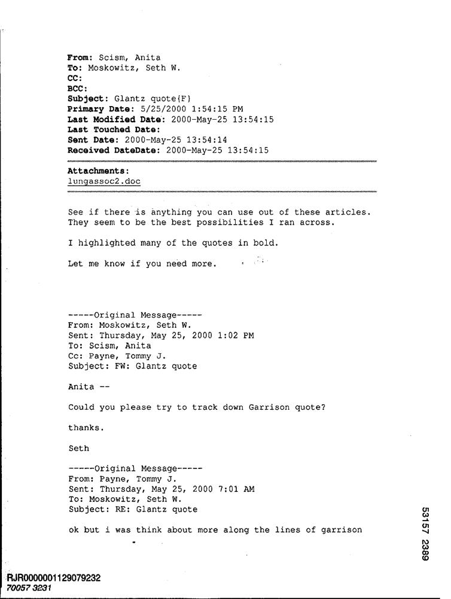

# Intelligent-Document-Understanding-API
 An intelligent document processing API built with FastAPI. Accepts image or PDF uploads, performs OCR to extract text, classifies the document type using semantic similarity (FAISS + Sentence Transformers), and extracts structured data fields with LLMs (via Ollama). Returns a clean, standardized JSON response with all relevant information.

 REST API built with **FastAPI** that processes documents (PDFs and images) to:

1. Perform OCR (EasyOCR for images, pdfplumber for PDFs).
2. Classify each document using semantic similarity (Sentence-Transformers + FAISS).
3. Extract specific fields based on the document type using a local *Llama 3* model served via **Ollama**.


---

## Table of Contents

- [Architecture & Flow](#architecture--flow)
- [Example of use ](#example-of-use)
- [Requirements](#requirements)
- [Environment variables and LLM configuration](#environment-variables-and-llm-configuration)
- [Logging and Observability](#logging-and-observability)
- [Installation](#installation)
- [Installation with Docker](#installation-with-docker)
- [Running the App](#running-the-app)
- [Running the App with Docker](#running-the-app-with-docker)
- [Endpoint: /extract\_entities](#endpoint-extract_entities)
- [Usage Examples](#usage-examples)
- [Project Structure](#project-structure)
- [Building or Updating the FAISS Index](#building-or-updating-the-faiss-index)
- [Testing](#testing)


---

## Architecture & Flow

1. **Upload & Validation**\
   The user uploads one or more files (`.pdf`, `.jpg`, `.png`, `.jpeg`).\
   Each file is validated to ensure it's in an accepted format.

2. **Temporary Storage**\
   Files are saved temporarily in a local `uploads/` directory.\
   A UUID is added to avoid filename collisions.

3. **OCR (Optical Character Recognition)**\
   If the file is an image, `EasyOCR` is used to extract text.\
   If it's a PDF, `pdfplumber` extracts text from each page.\
   If no legible text is found, a 415 error is raised.

4. **Semantic Document Classification**\
   The extracted text is embedded using a pre-trained `SentenceTransformer` model (`all-MiniLM-L6-v2`).\
   The embedding is compared against a `FAISS` vector index built from sample documents.\
   The top-matching document type (e.g., `invoice`, `receipt`, `memo`) is returned along with a confidence score and list of similar examples.

5. **Entity Extraction using LLM (via Ollama)**\
   A list of expected fields is loaded from `document_schema.json` based on the predicted document type.\
   A prompt is generated dynamically asking the LLM to extract those fields from the OCR’d text.\
   The prompt is sent to a locally running Llama 3 model served via **Ollama**.\
   The model returns a clean JSON object containing the extracted fields.

6. **Response Construction**\
   For each uploaded file, the final response includes:

   - The filename
   - Detected document type
   - Confidence score
   - Extracted structured fields (as JSON)
   - Confident score per entity

7. **Cleanup**\
   The temporary file is deleted after processing.

---

## Example of use 

### Uploaded image



### Reqeuest

```bash
curl -X POST http://localhost:8000/extract_entities/ \
  -F "files=@docs/531572389+-2390.jpg"
```

### Response
```json
{
  "results": [
    {
      "filename": "temp_22006d8d5414437a918beef298097465_531572389+-2390.jpg",
      "document_type": "email",
      "confidence": 0.8,
      "entities": {
        "sender": {
          "value": [
            "Moskowltz, Seth",
            "Moskowitz, Seth"
          ],
          "confidence": 0.75
        },
        "recipient": {
          "value": [
            "Scismr Anfta Io: Moskowltz, Seth",
            "Anita"
          ],
          "confidence": 0.7
        },
        "subject": {
          "value": [
            "Glantz quote {F} Prinary Dato",
            "EW: Glantz quote"
          ],
          "confidence": 0.85
        },
        "date_sent": {
          "value": [
            "5/25/2d00 1,54:15 PM",
            "2000-May-25 13,54,15",
            "Thursday, Max 25, 2000 1:02 PM",
            "Thursday, May 25, 2000 7,01 AM"
          ],
          "confidence": 0.8
        },
        "body": {
          "value": [
            "Scismr Anfta Io: Moskowltz, Seth $_ CC; Acc: Subject Glantz quote {F} Prinary Dato",
            "See ff there 18 anything You can use out of these articles Ibey seen to be the best poggibilltles an acro89",
            "I highlighted Many",
            "the quotes in bold",
            "Det me know 1f You need more.",
            "Orlglnal Message- Fron: Moskowitz, Seth Sent Ihursday, Max 25, 2000 1:02 PM Io: Scismr AnIta Cc: Payne, Iomny Subject EW: Glantz quote",
            "Anita",
            "Could You please try",
            "track down Garrison quote?",
            "thanks",
            "Seth",
            "Oríglnal Megsage-_ ron: Payner tonny Sent Ihursday, May 25, 2000 7,01 AM Io: Moskowitz, Seth Subject: RE: Glantz quote",
            "but",
            "w9B think about more #long the linee Of gerrieon",
            "9 g"
          ],
          "confidence": 0.65
        }
      },
      "processing_time": 9.569157874999291
    }
  ]
}
```
---

## Requirements

| Tool                | Recommended Version | Notes                        |
| ------------------- | ------------------- | ---------------------------- |
| Python              | ≥ 3.10              | Tested with 3.10.16          |
| pip / venv          | —                   | Use virtual environments     |
| Ollama              | ≥ 0.2.0             | Needs local `llama3.2` model |
| Git                 | —                   | To clone repo                |

---

### Environment variables and LLM configuration

## Environment variables

| Variable | Default | Purpose |
|-----------|---------|---------|
| `OLLAMA_API` | `http://localhost:11434/api/chat` | Base URL of the chat endpoint (Ollama or OpenAI-compatible). |
| `OLLAMA_MODEL` | `llama3.2` | Name or tag of the model to load with Ollama. |
| `FAISS_INDEX_PATH` | `vector_index.faiss` | Override path to the FAISS index file (used by `classifier.py`). |
| `FAISS_META_PATH` | `metadata.pkl` | Override path to pickled metadata that maps index rows to labels/paths. |
| `UPLOAD_DIR` | `uploads` | Temporary directory for files saved by FastAPI before processing. |
| `ALLOWED_EXTENSIONS` | `pdf,png,jpg,jpeg` | Comma-separated list checked by `allowed_file()`. |

> **Tip:** create a `.env` file at the project root so `uvicorn` can auto-load
> ```dotenv
> OLLAMA_API=http://localhost:11434/api/chat
> OLLAMA_MODEL=llama3.2
> FAISS_INDEX_PATH=vector_index.faiss
> FAISS_META_PATH=metadata.pkl
> UPLOAD_DIR=uploads
> ALLOWED_EXTENSIONS=pdf,png,jpg,jpeg
> ```

## LLM configuration

```python
OLLAMA_API   = os.getenv("OLLAMA_API",   "http://localhost:11434/api/chat")
MODEL_OLLAMA = os.getenv("OLLAMA_MODEL", "llama3.2")
```

* **Prompt builder** – `build_prompt()` injects the predicted `document_type`,
  expected field names, and raw OCR text.  
* **Response format** – the model must answer **only** with valid JSON.  
* **Streaming** – disabled (`"stream": False`) so the whole JSON can be parsed
  in one go.  
* **Error handling** – malformed JSON raises a `json.JSONDecodeError`
  (wrap this in a fallback strategy if desired).

To switch to OpenAI / Azure OpenAI:
1. Set `OLLAMA_API=https://api.openai.com/v1/chat/completions`.
2. Pass your `OPENAI_API_KEY` via headers in `HEADERS = {...}`.
3. Update the payload shape if your provider requires `model`, `max_tokens`,
   `temperature`, etc.


---


## Logging and Observability

This project uses structured **JSON logs** via [`python-json-logger`](https://pypi.org/project/python-json-logger/).

### Features

- All logs include:
  - `trace_id` — unique per request
  - `file` — full path of the uploaded file
  - Optional fields: `phase`, `error`, `processing_time`
- Logs are written to:
  - Console (`stderr`)
  - Rotating log file: `logs/app.log` (rotated daily, 14-day retention)

---

### Error logs

Errors are logged with a structured JSON entry that includes the error message and processing phase:

```json
{
  "asctime": "2025-06-20 18:22:04,993",
  "levelname": "ERROR",
  "name": "logging_setup",
  "message": "OCR failed",
  "trace_id": "1a51b256-1815-419b-b529-618b6e419d66",
  "file": "uploads/temp_a9e9a149f4b9429d9e76db60b8f70036_527814380+-4380.jpg",
  "phase": "ocr",
  "error": "error_message"
}
```
### LLM Model Response Logging

All responses returned by the LLM are logged to help with future improvements, debugging, and auditability. These logs include the original `raw_response` string returned by the model, along with relevant metadata for traceability.

#### Example log output (JSON structured):

```json
{
  "asctime": "2025-06-20 19:12:24,648",
  "levelname": "INFO",
  "name": "logging_setup",
  "message": "LLM response",
  "trace_id": "1066cb9e-fca7-4af2-a044-0bf41d4f42ee",
  "file": "uploads/temp_22006d8d5414437a918beef298097465_531572389+-2390.jpg",
  "phase": "llm",
  "raw_response": "{\n  \"sender\": {\n    \"value\": [\"Moskowltz, Seth\", \"Moskowitz, Seth\"],\n    \"confidence\": 0.75\n  },\n  \"recipient\": {\n    \"value\": [\"Scismr Anfta Io: Moskowltz, Seth\", \"Anita\"],\n    \"confidence\": 0.7\n  },\n  \"subject\": {\n    \"value\": [\"Glantz quote {F} Prinary Dato\", \"EW: Glantz quote\"],\n    \"confidence\": 0.85\n  },\n  \"date_sent\": {\n    \"value\": [\"5/25/2d00 1,54:15 PM\", \"2000-May-25 13,54,15\", \"Thursday, Max 25, 2000 1:02 PM\", \"Thursday, May 25, 2000 7,01 AM\"],\n    \"confidence\": 0.8\n  },\n  \"body\": {\n    \"value\": [\"Scismr Anfta Io: Moskowltz, Seth $_ CC; Acc: Subject Glantz quote {F} Prinary Dato\", \"See ff there 18 anything You can use out of these articles Ibey seen to be the best poggibilltles an acro89\", \"I highlighted Many\", \"the quotes in bold\", \"Det me know 1f You need more.\", \"Orlglnal Message- Fron: Moskowitz, Seth Sent Ihursday, Max 25, 2000 1:02 PM Io: Scismr AnIt\"],\n    \"confidence\": 0.85\n  }
}
```

### Info logs

Informational messages follow the same structure, but the `error` field is an empty string (`""`), and the phase indicates what stage of the pipeline is being logged:

```json
{
  "asctime": "2025-06-20 18:22:04,993",
  "levelname": "INFO",
  "name": "logging_setup",
  "message": "Processing image file",
  "trace_id": "1a51b256-1815-419b-b529-618b6e419d66",
  "file": "uploads/temp_....jpg",
  "phase": "ocr",
  "error": ""
}
```

### Completion log

Once a document has been fully processed, a final log is recorded summarizing the total processing time:

```json
{
  "asctime": "2025-06-20 18:22:10,652",
  "levelname": "INFO",
  "name": "logging_setup",
  "message": "File Process Completed",
  "trace_id": "1a51b256-1815-419b-b529-618b6e419d66",
  "file": "uploads/temp_....jpg",
  "time": "5.659293875000003"
}
```


---

## Installation
1. **Install Ollama**\
   Install ollama from https://ollama.com/download
   then run
   ```bash
   $ ollama run llama3:2  # downloads the model on first run
   ```
1. **Project installation**\
   Install the python dependencies\
```bash
# 1. Clone the repository
$ git clone https://github.com/guillenortizrodrigo/Intelligent-Document-Understanding-API.git
$ cd Intelligent-Document-Understanding-API

# 2. Create virtual environment
$ python -m venv venv && source venv/bin/activate

# 3. Install dependencies
$ pip install -r requirements.txt
```

> **Tip**: If you're on Linux, install system dependencies like Tesseract and libmagic (see `docs/setup_system_deps.md`).

---

## Installation with Docker
```bash
# 1. Clone the repository
$ git clone https://github.com/guillenortizrodrigo/Intelligent-Document-Understanding-API.git

# 2. Go to the project directory
$ cd Intelligent-Document-Understanding-API

# 3. Start the application with Docker
$ docker compose up

# 4. n another terminal, pull the Llama model:
$ docker compose exec ollama ollama pull llama3:8b

#5 Press Ctrl + C in the terminal running Docker. 
```

---

## Running the App

### Development Mode

```bash
uvicorn main:app --reload
```

Visit [http://localhost:8000/docs](http://localhost:8000/docs) for interactive Swagger docs.

---

## Running the App with Docker
   ```bash
   # 1) Open a terminal in the project directory
   
   # 2) Run the docker compose file
   $ docker compose up
   ```
---

## Endpoint `/extract_entities`

| Method | Path                 | Description                                                                                                |
| ------ | -------------------- | ---------------------------------------------------------------------------------------------------------- |
| `POST` | `/extract_entities/` | Accepts multiple files (`pdf`, `png`, `jpg`, `jpeg`) and returns type, confidence, and extracted entities. |

### Form-data Parameters

| Field   | Type      | Required | Description        |
| ------- | --------- | -------- | ------------------ |
| `files` | File\( \) | ✔        | One or more files. |

### Example Response *(200 OK)*

```json
{
  "results": [
    {
      "filename": "invoice_123.pdf",
      "document_type": "invoice",
      "confidence": 0.92,
      "entities": {
        "invoice_number": "F-123",
        "total": 1570.55,
        "date": "2025-06-01",
        "supplier": "ABC Inc."
      }
    }
  ]
}
```
---

## Usage Examples

### cURL

```bash
curl -X POST \
  -F "files=@samples/invoice.pdf" \
  -F "files=@samples/receipt.jpg" \
  http://localhost:8000/extract_entities/
```

### Python

```python
import requests
files = [
    ("files", open("samples/invoice.pdf", "rb")),
    ("files", open("samples/receipt.jpg", "rb"))
]
response = requests.post("http://localhost:8000/extract_entities/", files=files)
print(response.json())
```

---

## Project Structure

```
.
├── main.py                # FastAPI entrypoint
├── ocr.py                 # OCR functions
├── classifier.py          # FAISS-based classifier
├── extractor.py           # Entity extractor via Ollama
├── document_schema.json   # Expected fields per document type
├── vector_index.faiss     # Prebuilt FAISS index
├── metadata.pkl           # Metadata for the index
├── uploads/               # Temporary file folder (git-ignored)
└── requirements.txt       # Python dependencies
```

---

## Building or Updating the FAISS Index

1. Organize representative samples by type (`docs-sm/<label>/*.png|pdf`).
2. Run `scripts/build_index.py` to generate embeddings and index.
3. This will create `vector_index.faiss` and `metadata.pkl`.

> Rebuild the index whenever new document types or samples are added.

---

## Testing

1. Install pytest
   ```bash
   $ python install pytest
   ```
2. Run `pytest -v` to execute all the tests defined on test_api.py.

| Component         | Test file                      | Description                                                                 |
|------------------|--------------------------------|-----------------------------------------------------------------------------|
| **OCR**          | `tests/test_ocr.py`            | Tests image and PDF processing. Ensures OCR runs on empty files and verifies preprocessing steps. |
| **Classifier**   | `tests/test_classifier.py`     | Checks that embeddings are generated from text and return correct labels and scores. |
| **LLM Prompt**   | `tests/test_llm.py`            | Validates the prompt construction and handles malformed JSON from the LLM. |
| **API Integration** | `tests/test_integration_api.py` | Simulates full pipeline: upload → OCR → classify → extract entities with LLM. Uses mocks for isolation. |

### CI Implementation with GithubActions

- Tests are automatically triggered on every push using **GitHub Actions**.
- The workflow configuration can be found in `.github/workflows/`.

---
